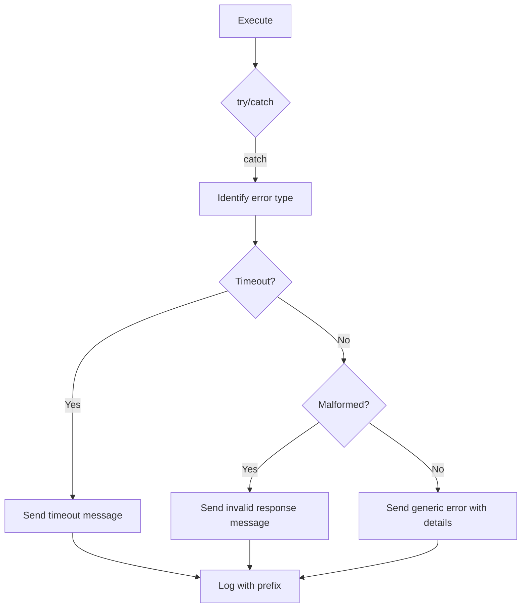

# Design Document: Anime Wallpaper Plugin

## Overview

The anime-wallpaper plugin adds wallpaper search and random retrieval capabilities to the WADASHV2 WhatsApp bot. It integrates the `anime-wallpaper` npm package to fetch anime wallpapers from multiple sources (WallHaven, ZeroChan, Wallpapers.com, Pinterest, Moe Walls) and delivers them as image messages in WhatsApp chats.

The plugin follows the established WADASHV2 plugin architecture: a single TypeScript module exporting `command`, `category`, and `execute`, registered in the plugin index. It uses the existing `sendWithTyping` utility for natural message delivery and supports multiple command aliases (`wallpaper`, `wp`, `animewp`).

**Key Design Decisions:**
- Single-file plugin (no sub-modules) to match existing plugin patterns (`ping.ts`, `sticker.ts`)
- Lazy instantiation of `AnimeWallpaper` client (one instance per plugin load)
- Source resolution via a lookup map for O(1) case-insensitive matching
- Timeout wrapper around external API calls for reliability
- All responses quoted to the original message for conversational context

## Architecture

```mermaid
flowchart TD
    A[User sends command] --> B[Plugin Registry]
    B --> C[wallpaper.ts execute]
    C --> D{Parse args}
    D -->|No args| E[Send usage message]
    D -->|"random" subcommand| F[Random wallpaper flow]
    D -->|Search query| G[Resolve source]
    G --> H{Valid source?}
    H -->|No| I[Send source list]
    H -->|Yes| J[Search wallpaper flow]
    F --> K[AnimeWallpaper.random]
    J --> L[AnimeWallpaper.search]
    K --> M{Result?}
    L --> M
    M -->|Success| N[Send image via sendWithTyping]
    M -->|No results| O[Send "not found" text]
    M -->|Error| P[Send error text + log]
```

### Data Flow

1. **Input**: User message arrives → plugin registry matches alias → `execute(sock, msg, args, settings)` called
2. **Parsing**: `args` array is parsed to extract optional source identifier and search query
3. **Dispatch**: Based on parsed input, one of three paths is taken: usage help, random wallpaper, or search wallpaper
4. **External Call**: `AnimeWallpaper` client is called with appropriate method and parameters
5. **Output**: Result is formatted as an image message or error text and sent via `sendWithTyping`

## Components and Interfaces

### Plugin Module (`src/engine/plugins/wallpaper.ts`)

```typescript
// Exports conforming to Plugin interface
export const command: string[] = ['wallpaper', 'wp', 'animewp'];
export const category: string = 'anime';
export async function execute(
    sock: ReturnType<typeof makeWASocket>,
    msg: WAMessage,
    args: string[],
    settings: Record<string, any>
): Promise<void>;
```

### Internal Functions

| Function | Signature | Purpose |
|----------|-----------|---------|
| `resolveSource` | `(input: string) => AnimeSource \| null` | Maps user input string to AnimeSource enum (case-insensitive) |
| `parseArgs` | `(args: string[]) => { source: AnimeSource; query: string } \| { error: string }` | Parses command arguments into source + query or error |
| `searchWallpaper` | `(query: string, source: AnimeSource) => Promise<WallpaperResult>` | Wraps AnimeWallpaper.search with timeout |
| `getRandomWallpaper` | `() => Promise<WallpaperResult>` | Wraps AnimeWallpaper.random with timeout |
| `withTimeout` | `<T>(promise: Promise<T>, ms: number) => Promise<T>` | Generic timeout wrapper that rejects after specified ms |

### Source Map

```typescript
const SOURCE_MAP: Record<string, AnimeSource> = {
    wallhaven: AnimeSource.WallHaven,
    zerochan: AnimeSource.ZeroChan,
    wallpapers: AnimeSource.Wallpapers,
    pinterest: AnimeSource.Pinterest,
    moewalls: AnimeSource.MoeWalls,
};
```

### Dependencies

- `anime-wallpaper` (^3.2.2) — `AnimeWallpaper` class, `AnimeSource` enum
- `@whiskeysockets/baileys` — `WAMessage`, `makeWASocket` types
- `./utils` — `sendWithTyping` utility

## Data Models

### WallpaperResult (from anime-wallpaper package)

```typescript
interface WallpaperResult {
    title?: string;
    image: string;       // URL to the wallpaper image
    thumbnail?: string;  // URL to thumbnail (if available)
    source?: string;     // Source website name
}
```

### ParsedCommand (internal)

```typescript
type ParsedCommand =
    | { type: 'search'; source: AnimeSource; query: string }
    | { type: 'random' }
    | { type: 'usage' }
    | { type: 'invalid_source'; input: string }
    | { type: 'missing_query'; source: string };
```

### Message Content Shapes

```typescript
// Image message
{ image: { url: string }, caption: string }

// Text message (errors, usage)
{ text: string }

// Options (always included)
{ quoted: WAMessage }
```

## Correctness Properties

*A property is a characteristic or behavior that should hold true across all valid executions of a system — essentially, a formal statement about what the system should do. Properties serve as the bridge between human-readable specifications and machine-verifiable correctness guarantees.*

### Property 1: Search dispatch correctness

*For any* valid search query string (1-100 characters) and any valid resolved source, the plugin SHALL call `AnimeWallpaper.search` with a title matching the query and the correct `AnimeSource` enum value for that source.

**Validates: Requirements 1.1, 2.1**

### Property 2: First result selection and image format

*For any* non-empty array of wallpaper results returned by the client, the plugin SHALL send an image message where the URL equals the first result's `image` field and the caption contains the source name.

**Validates: Requirements 1.2, 6.2**

### Property 3: Case-insensitive source resolution

*For any* valid source identifier string in any combination of upper/lower case characters, the `resolveSource` function SHALL return the same correct `AnimeSource` enum value as the canonical lowercase version.

**Validates: Requirements 2.1, 2.2**

### Property 4: Invalid source rejection

*For any* string that does not match (case-insensitively) any key in the SOURCE_MAP, the plugin SHALL send a text message listing all valid source identifiers.

**Validates: Requirements 2.4**

### Property 5: Error messages include context

*For any* error thrown by the AnimeWallpaper client during a search with a given query, the text message sent to the user SHALL contain both a substring of the error message and the attempted search query.

**Validates: Requirements 5.1**

### Property 6: Console logging with prefix

*For any* error that occurs during plugin execution, `console.error` SHALL be called with a message that starts with the prefix "[Wallpaper]".

**Validates: Requirements 5.3**

### Property 7: Message delivery invariant

*For any* execution path through the plugin (success, error, usage, invalid source), every call to `sendWithTyping` SHALL include `{ quoted: msg }` in the options argument, where `msg` is the original incoming message.

**Validates: Requirements 6.1, 6.3**

## Error Handling

### Error Categories

| Error Type | Trigger | User Message | Log |
|-----------|---------|--------------|-----|
| Empty args | No arguments provided | Usage format with command name | None |
| Invalid source | Unrecognized source identifier | List of valid sources | None |
| Missing query | Source provided but no search term | Usage format with source | None |
| No results | Client returns empty array | "No wallpapers found for '{query}'" | None |
| API error | Client throws exception | "Search failed: {error.message} (query: {query})" | `[Wallpaper] {error.message}` |
| Timeout | No response within 15s (search) / 30s (image) | "Connection timeout" | `[Wallpaper] Timeout: {query}` |
| Malformed response | Client returns data without valid image URL | "Source returned invalid response" | `[Wallpaper] Malformed response: {JSON}` |
| Image delivery failure | Image URL unreachable or empty | "Wallpaper image could not be delivered" | `[Wallpaper] Image load failed: {url}` |

### Timeout Strategy

- **API search timeout**: 15 seconds — wraps `AnimeWallpaper.search()` and `AnimeWallpaper.random()`
- **Image delivery timeout**: Handled by Baileys internally (30s default socket timeout)
- Implementation: Generic `withTimeout` helper using `Promise.race` with a rejecting timer

### Error Flow



## Testing Strategy

### Unit Tests (Example-Based)

Unit tests cover specific scenarios and edge cases:

- **Usage message**: Empty args → sends usage text
- **Default source**: Query without source → uses WallHaven
- **Random wallpaper**: Calls `random({ resolution: "1920x1080" })`
- **No results**: Empty result array → sends "not found" message
- **Valid source + no query**: Sends "search term required" message
- **Timeout handling**: Simulated timeout → sends timeout message
- **Malformed response**: Missing image URL → sends invalid response message
- **Command registration**: Exports match expected aliases and category

### Property-Based Tests

Property-based testing is appropriate for this feature because the argument parsing, source resolution, and message formatting logic are pure functions with clear input/output behavior and a large input space (arbitrary strings, case variations).

**Library**: `fast-check` (TypeScript property-based testing library)
**Minimum iterations**: 100 per property

Each property test references its design document property:

| Test | Property | Tag |
|------|----------|-----|
| Search dispatch | Property 1 | `Feature: anime-wallpaper, Property 1: Search dispatch correctness` |
| First result + image format | Property 2 | `Feature: anime-wallpaper, Property 2: First result selection and image format` |
| Case-insensitive source | Property 3 | `Feature: anime-wallpaper, Property 3: Case-insensitive source resolution` |
| Invalid source rejection | Property 4 | `Feature: anime-wallpaper, Property 4: Invalid source rejection` |
| Error context in messages | Property 5 | `Feature: anime-wallpaper, Property 5: Error messages include context` |
| Logging prefix | Property 6 | `Feature: anime-wallpaper, Property 6: Console logging with prefix` |
| Quoted message invariant | Property 7 | `Feature: anime-wallpaper, Property 7: Message delivery invariant` |

### Integration Tests

- **End-to-end search**: Real API call to WallHaven with known query, verify image URL returned
- **Plugin registry**: Import registry, verify all aliases resolve to the wallpaper plugin
- **sendWithTyping integration**: Verify typing indicator is sent before message

### Test Mocking Strategy

- Mock `AnimeWallpaper` class methods (`search`, `random`) for unit and property tests
- Mock `sendWithTyping` to capture arguments without sending real WhatsApp messages
- Mock `console.error` to verify logging behavior
- Use real `AnimeWallpaper` only in integration tests (rate-limited, not in CI)
