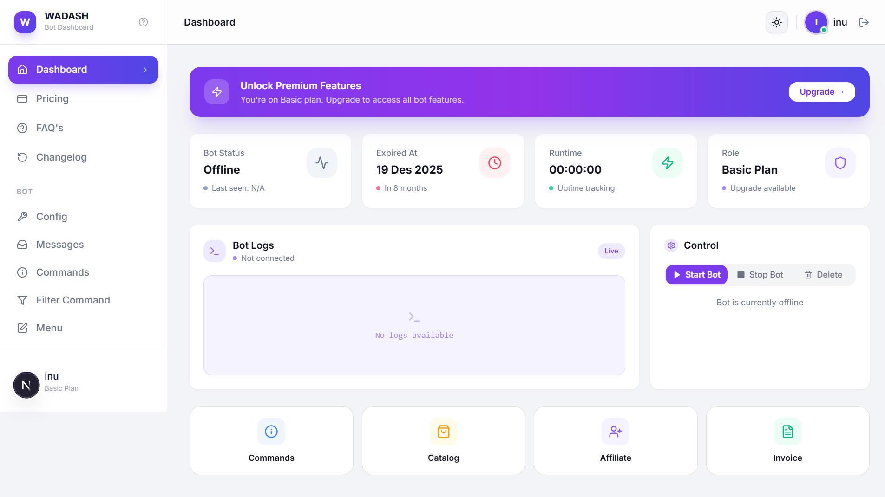
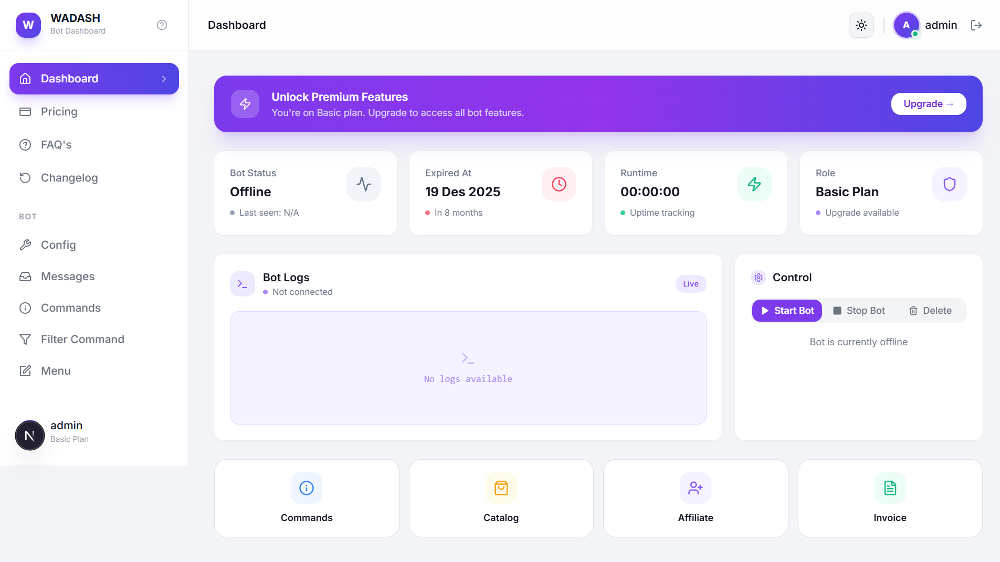
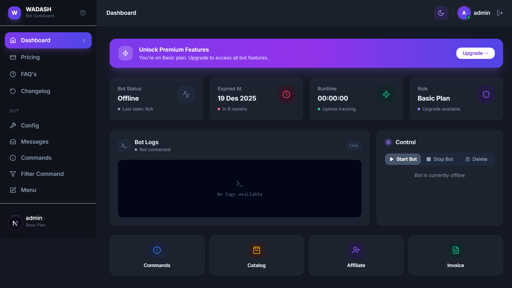
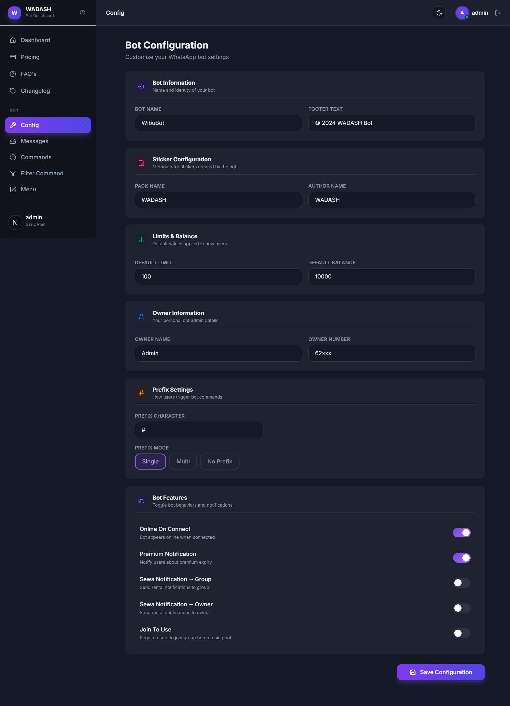

# WADASHV2 🤖

**WADASH V2** adalah dashboard modern untuk mengelola WhatsApp Bot dengan antarmuka yang elegan, bersih, dan profesional. Dibangun menggunakan Next.js 15 dengan TypeScript dan Tailwind CSS.


---

## 📸 Screenshots

### 🔐 Login Page


### ☀️ Dashboard — Light Mode


### 🌙 Dashboard — Dark Mode


### ⚙️ Bot Configuration


---

## 📝 Changelog

### Version 2.4.1 (Latest)
- **Animated Sticker Support**: Menambahkan dukungan pembuatan stiker bergerak dari **Video** dan **GIF**. Fitur ini tersedia pada perintah `sticker` (plugin) dan juga pada sistem **API Responder**.
- **FFMPEG Path Resolution Fix**: Memperbaiki error `ENOENT` pada `ffmpeg-static` yang sering terjadi di environment Next.js/Windows/Docker dengan mengimplementasikan pencarian path binary secara runtime mendasarkan pada real-CWD.
- **Architectural Refactoring**: Memisahkan konfigurasi media engine ke dalam `src/engine/lib/ffmpeg.ts` untuk menghindari *circular dependency* (ReferenceError) pada sistem plugin.
- **Improved API Responder**: Penambahan logika deteksi `content-type` otomatis untuk mengonversi hasil fetch API (Video/GIF) langsung menjadi stiker WhatsApp yang valid.

### Version 2.4.0
- **Bot API Responders**: Integrasi penuh dynamic API Webhook. `BotManager.ts` sekarang dapat mem-parsing dan mengeksekusi external API calls dengan dukungan konversi media (text, image, video) secara otomatis, dan sticker-processing menggunakan `sharp`.
- **Modular Plugin Architecture**: Fitur perintah hardcoded telah direfaktor menjadi arsitektur plugin modular di `src/engine/plugins`. Mendukung berbagai perintah dinamis (`ping`, `sticker`, `eval`, `exec`).
- **Owner Security Verification**: Layer proteksi untuk command berbahaya (eval/exec) dengan validasi nomor Owner yang ter-normalisasi.
- **Dynamic Command Handling & Menu**: Parsing command yang telah ditingkatkan, mendukung mode `single`, `multi`, atau `empty` (tanpa prefix) secara dinamis, serta integrasi dashboard untuk manajemen format menu bot.
- **Enhanced Observability via SSE**: Peningkatan pelacakan uptime yang otomatis ter-sync melalui Server-Sent Events untuk ditampilkan secara *real-time* di UI dashboard.
- **Multi-Tenant Storage Fixes**: Optimasi folder struktur database JSON (berbasis UUID) mencegah kebocoran sesi Baileys antar akun.

---

## ✨ Fitur Utama WADASH V2

### 🌐 Fitur Website (Dashboard Next.js)
Tampilan WADASH V2 dibangun secara modern menggunakan Next.js App Router dan antarmuka berbasis komponen UI (Radix/Shadcn). Fitur yang tersedia pada website ini:
- **Multi-Tenant Dashboard**: Mendukung manajemen banyak pengguna dalam satu aplikasi, di mana tiap pengguna memiliki database konfigurasi bot dan sesi otentikasi WhatsApp (Baileys UUID isolation) secara terpisah dan aman.
- **Sistem Autentikasi**: Fitur Login & Registrasi pengguna yang tertutup rapat oleh keamanan session management berbasis *HTTP-only cookies*.
- **Dark/Light Mode**: Tema antarmuka yang dapat diubah dan tersimpan otomatis dengan estetik *Glassmorphism*.
- **Live Terminal & Stat Cards**: Menampilkan log CLI, status koneksi perangkat secara langsung, serta *Uptime* (durasi bot menyala aktif) langsung ke dalam GUI browser memanfaatkan teknologi *Server-Sent Events (SSE)*.
- **Bot Configuration Editor**: Formulir interaktif untuk langsung mengatur pengaturan bot:
  - Mengubah nama bot, nomor WhatsApp *Owner*, *limit* interaksi, dan saldo *balance*.
  - Menentukan nama kemasan *sticker* (packname) beserta penulis kreatornya (author).
  - Integrasi prefix dinamis: Dukungan prefix *Single* (seperti `/`, `!`), *Multi-prefix*, maupun *Tanpa Prefix*.
  - *Feature Toggles*: Mengaktifkan notifikasi premium, mengatur otomatis online, dll.

### 🤖 Fitur Engine WhatsApp Bot (`src/engine`)
Beroperasi mandiri di balik layar menggunakan *singleton pattern* `@whiskeysockets/baileys`:
- **Dynamic API Webhook Responders**: Engine berkemampuan super ini dapat mengkonsumsi/memparsing balasan langsung dari URL API pihak ketiga. Mampu otomatis me-render tipe response berbentuk teks, memutar video, mengunduh file gambar, dan proses automasi media-handling dari API menjadi Sticker WhatsApp (Statik maupun Animasi).
- **Modular Command Plugins**: Arsitektur perintah bot yang sepenuhnya dinamis terbagi ke dalam sub-folder `src/engine/plugins`. Memudahkan siapapun untuk menambah kapabilitas bot baru (cukup melempar file JS/TS).
- **Bot Commands Bawaan WADASH V2**:
  1. `ping`: Mengecek latency waktu respons sistem ke server WhatsApp beserta total durasi uptime.
  2. `sticker`: Fitur instant-maker pengubah otomatis setiap kiriman format gambar, video, atau GIF menjadi *WhatsApp Sticker* sempurna bersama metadata author dari konfigurasi.
  3. `eval` & `exec`: *Terminal Command* tingkat super-admin untuk mengeksekusi instruksi JavaScript atau *Shell Server* langsung dari ruang percakapan WhatsApp.
- **Owner Security System**: Eksekusi perintah divalidasi sangat ketat melalui format penomoran internasional yang ternormalisasi secara cerdas, memblokir penggunaan command berbahaya (`exec`, `eval`) oleh angka/pengguna acak sehingga engine tetap aman terlindungi jika digunakan untuk komersil SaaS.

---

## 🚀 Getting Started

### Prerequisites
- Node.js 18+
- npm, pnpm, yarn, bun

### Installation

1. Clone repository:
```bash
git clone https://github.com/dikobokobok/WADASHV2.git
cd WADASHV2
```

2. Install dependencies:
```bash
npm install
```

3. Jalankan development server:
```bash
npm run dev
```

4. Buka browser dan akses [http://localhost:3000](http://localhost:3000)

### Default Accounts

| Role  | Username    | Email                  | Password      |
|-------|-------------|------------------------|---------------|
| Admin | `admin`     | `admin@wadash.me`      | `admin123`    |
| Test  | `TestUser`  | `test@example.com`     | `password123` |

---

## 📁 Struktur Project Prioritas

```text
WADASHV2/
├── src/
│   ├── app/                      
│   ├── components/
│   │   ├── ui/                   # Modular shadcn-based components (Avatar, Button, Card dll)
│   │   └── ...                   
│   └── engine/
│       ├── plugins/              # Bot Command Plugins (ping, owner command, dsb)
│       └── BotManager.ts         # Singleton WhatsApp Baileys Instance Manager
├── database/                     # Tempat Database Session Multi-tenant & JSON user
└── public/                       # Assets UI, Screenshots   
```

---

## 🛠️ Tech Stack

- **Framework**: Next.js 15 (App Router) dengan Turbopack
- **Language**: TypeScript 5
- **Styling**: Tailwind CSS 3
- **Core Engine**: Baileys (`@whiskeysockets/baileys`)
- **Database**: Local JSON File-based (Zero config)

<br/>

**Version:** 2.4.1  
**License:** MIT  
**Author:** [dikobokobok](https://github.com/dikobokobok)
